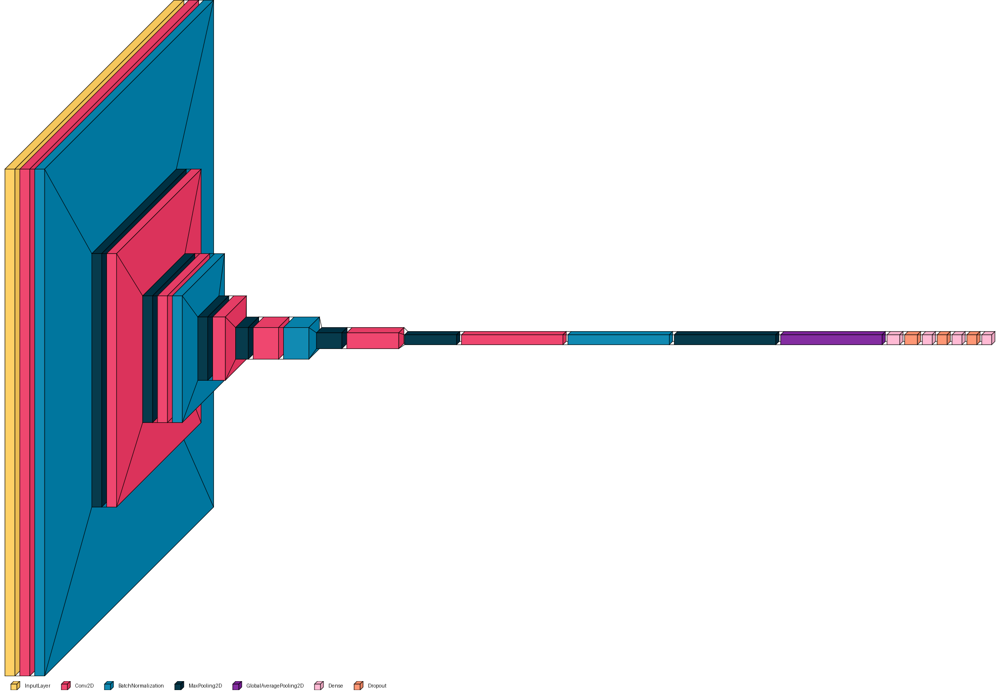
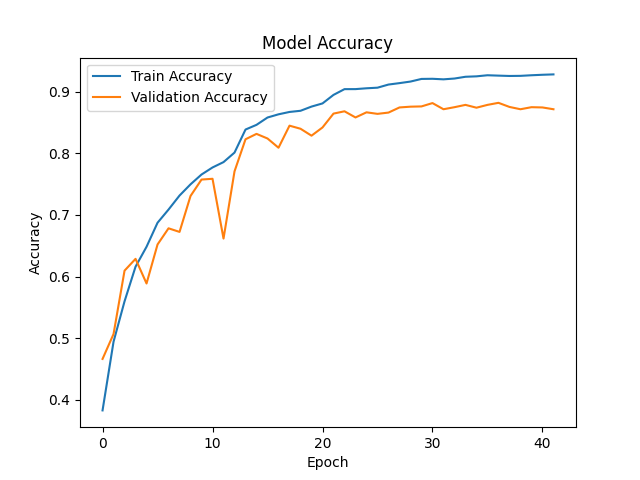
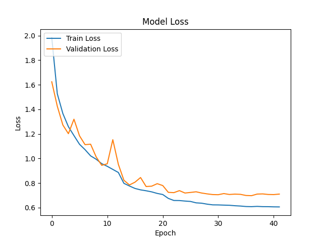
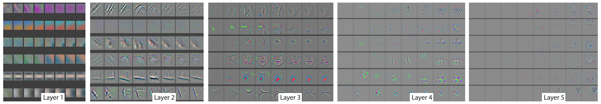
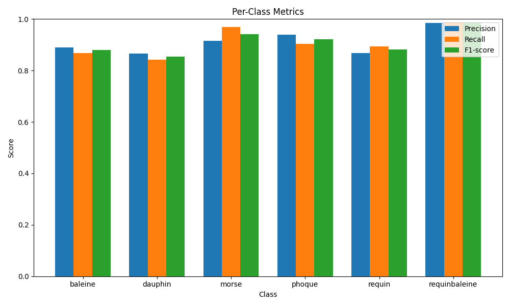
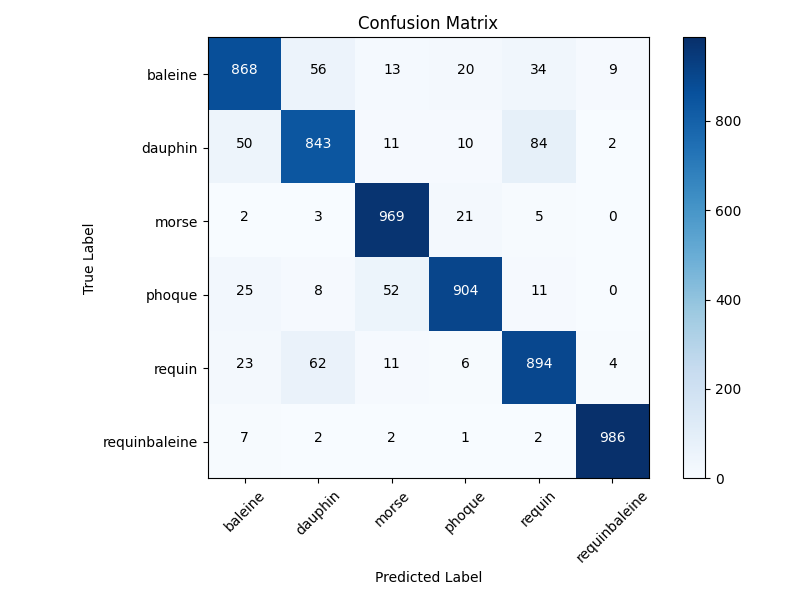
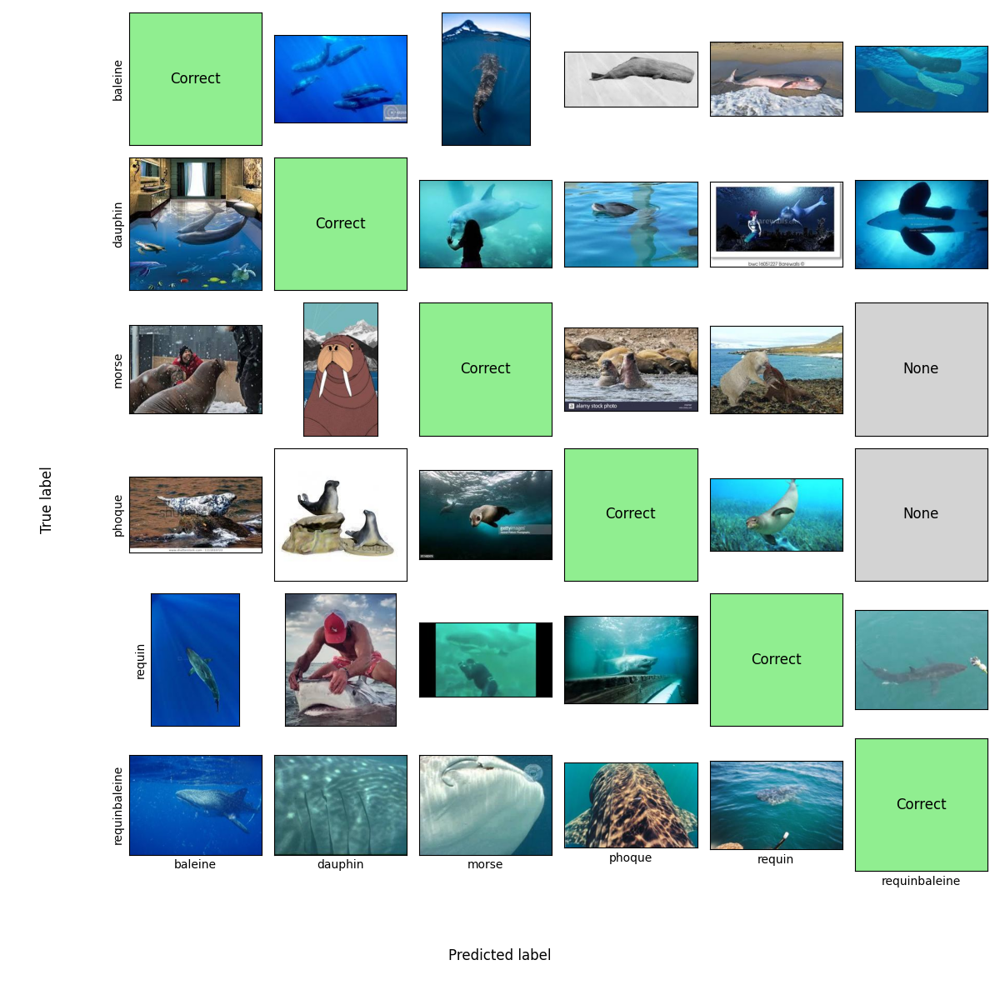

# INF7370
## 1. Introduction

Ce travail a pour but d'entraîner un réseau de neurones pour la classification d'images à l'aide d'une architecture personnalisée. L'objectif est de tester différentes architectures et de valider les performances de ces modèles. Le but est de trouver le modèle offrant les meilleures performances (précision). Pour deux modèles ayant la même performance ou des performances très similaires, on privilégiera le modèle le plus rapide à entraîner.

Ce document présente les données et la classe utilisée pour faire la classification d'images, l'augmentation des données, l'architecture du modèle final et les étapes pour se rendre à un tel modèle. Nous présenterons les résultats de l'entraînement et l'évaluation du modèle avec des graphiques de perte, précision, rappel et matrice de confusion.

## 2. Montage de l’architecture et entrainement du modèle

### 2.1 Ensemble de données

Les données sont des images de 6 classes d'animaux marins. Nous avons des images de :

- Baleine
- Dauphin
- Morse
- Phoque
- Requin
- Requin-baleine


Au total, nous avons 30 000 images, réparties en 1 000 exemples de test et 4 000 exemples d'entraînement et de validation par classe.

Nous avons fini par séparer les données d'entraînement et de validation selon un ratio de 85 % pour l'entraînement et 15 % pour la validation. L'ensemble de données est relativement petit. Il est donc important de fournir plus d'exemples à l'entraînement pour varier les données.
En tout, nous avons 4 000 images par classe. En les séparant à 85 % pour l'entraînement, cela nous donne `4000 × 0.85 = 3400` images d'entraînement par classe et `600` images de validation. Les données sont mélangées aléatoirement pendant l'entraînement pour limiter le surapprentissage du modèle.
Au final, on évalue le modèle avec l'ensemble de test, composé de `1000` images par classe, pour calculer les métriques (matrice de confusion et F1-score).

Nous avons choisi de ne pas ajouter de classe "autre" contenant des images d'autres types d’animaux marins, ou même des images aléatoires trouvées sur le web. Normalement, il est intéressant qu’un modèle soit capable d’identifier s’il s’agit ou non d’un animal marin appartenant à nos classes.
Dans notre cas, on s’intéresse surtout au fonctionnement du réseau de neurones et à l’apprentissage et non à une application concrète. Si on fournit une image d’un autre type (par exemple, un chien ou un chat), le modèle attribuera tout de même une classe d’animal marin.

Les images sont en couleur (3 canaux) et sont de tailles diverses. Certaines sont en mode paysage, d’autres en mode "téléphone". En général, la longueur et la hauteur ne dépassent pas 256 pixels.

Les types et positions des images varient : il y a des animaux vus de face, de côté, dans l’eau, sur la plage, ou même des dessins. Parfois, l’animal prend tout l’espace de l’image, d’autres fois seulement une partie. Certaines images montrent plusieurs animaux, d’autres un seul. Certaines contiennent du texte. Certaines sont en noir et blanc.

Concernant les erreurs de classification dans les données : nous ne sommes pas experts en animaux marins, mais il ne semble pas y avoir d’erreurs flagrantes (comme un cheval classé dans "baleine"). On suppose donc que les animaux sont bien étiquetés.

En ce qui concerne les duplications, nous n’avons pas remarqué de doublons à première vue. On suppose donc que le dataset ne contient pas de duplications. Même s’il y avait quelques images dupliquées, cela n’aurait pas un grand impact sur le réseau, puisque de toute façon, nous faisons de l’augmentation de données et nous entraînons sur plusieurs époques.
Une image dupliquée ne sera pas identique d’un passage à l’autre grâce aux transformations appliquées (rotation, déformation, changement d’intensité, recadrage). De plus, faire passer plusieurs fois les mêmes données dans le modèle permet d’en apprendre les caractéristiques.

</img>

Voici un exemple d'image (`donnees\entrainement\baleine\0478.jpg`) potentiellement problématique dans l'ensemble de données d'entraînement.

Pour cette tâche, nous nous concentrons exclusivement sur l'apprentissage du modèle et sur ses performances. Nous n’exclurons donc aucune image des données.

### 2.2 Traitement de données

Nous avons construit une classe `DataLoader` qui se charge de fournir les exemples au modèle lors de l'entraînement. Cette classe utilise la librairie `ImageDataGenerator` de `TensorFlow`. Elle se charge d’effectuer l’**augmentation des données**. On définit les paramètres suivants :

- `rescale=1./255` : Normalise les pixels entre 0 et 1. Un pixel d'une image contient 3 canaux RGB (rouge, vert, bleu). La combinaison de ces couleurs forme n'importe quelle couleur. L'intensité des couleurs primaires est définie en `int8` (valeurs entières entre 0 et 255). Passer ces valeurs directement au modèle est problématique, puisque les nombres servent à l’activation des neurones. La fonction d'activation s'attend à recevoir des valeurs entre 0 et 1. Il faut donc **normaliser les valeurs des pixels** avant de les passer à la première couche du réseau de neurones.

- `rotation_range=45` : On définit un seuil de rotation de 45° pour les images. Les images auront une rotation aléatoire de ±45° avant d’être passées au modèle.

- `width_shift_range=0.3, height_shift_range=0.3` : Déplace l’image sur les axes x et y de 30 %. Une image peut donc être déplacée jusqu’à 30 % de sa largeur ou de sa hauteur. À ce stade, il est possible qu’on ne voie plus grand-chose de l’image originale, et l’animal pourrait même se retrouver hors du cadre (s’il est déjà situé dans un coin, par exemple).

- `zoom_range=0.3` : Applique un zoom de 30 % à l’image. Il est possible que l’animal sorte du cadre, mais à 30 %, il y a de bonnes chances qu’il soit toujours visible.

- `brightness_range=[0.8, 1.2]` : En plus de normaliser les pixels en entrée, on modifie aussi l’intensité de tous les pixels entre **0,8** et **1,2**. Il est donc possible que certains pixels aient une valeur supérieure à 1 (allant potentiellement jusqu'à une intensité de `1.2`). Voir la section "**problème de la disparition du gradient**", où il est expliqué quels sont les impacts d’avoir une activation de `1.2` pour un neurone.

- `horizontal_flip=True` : Applique une **symétrie horizontale** à l’image (retournement gauche-droite).

- `validation_split=0.10` : Définit le **ratio** de séparation entre l’ensemble d'entraînement et celui de validation. Étant donné que nous voulons entraîner le modèle avec le plus de diversité possible (les réseaux de neurones performent mieux avec plus de données) et que notre ensemble de données n’est pas infini, nous voulons avoir le plus d’exemples possible pour l'entraînement. C’est pourquoi nous avons choisi une division à `0.1` au lieu de `0.15` ou plus.

Tous ces paramètres sont appliqués aléatoirement sur les données d’entrée. Cette augmentation des données semble compliquer la tâche du modèle à première vue, mais elle est essentielle pour la généralisation. Sans cette augmentation, le modèle performerait très bien sur l’ensemble d'entraînement, en apprenant trop bien les caractéristiques des images. Par contre, en situation réelle ou sur des images inédites, il ne serait pas capable de généraliser.  

L’augmentation des données est un élément clé pour une meilleure capacité de généralisation.

### 2.3 Paramètres et Hyperparamètres

**Problème de la disparition du gradient**

Nous utilisons l'optimiseur Adam. Cet optimiseur unit deux concepts clés pour une convergence plus rapide que la descente de gradient stochastique de base. Adam utilise toujours le concept du *stochastic gradient descent* (SGD), mais il ajoute **(1) l'inertie du gradient** et **(2) une adaptation de l'apprentissage pour chaque poids**.

**1. L'inertie du gradient**

L'optimiseur Adam calcule l'inertie du gradient. Normalement, on utilise seulement le taux d'apprentissage pour calculer le gradient. Ce taux d'apprentissage nous indique à quelle vitesse / de combien au maximum on ajuste les poids. Le taux dicte l’amplitude de l’ajustement. L’inertie permet de converger plus rapidement qu’un pas fixe, car elle augmente cet ajustement en fonction du degré du gradient. Un grand gradient signifie qu’un poids a potentiellement causé une grande erreur dans la classification. On a le choix de définir un taux d’apprentissage global fixe pour ajuster tous les poids, mais dans un cas où un poids cause une plus grande erreur que les autres, on préférerait lui appliquer un ajustement plus important. L’inertie ajuste donc le taux d’apprentissage de chaque poids pour donner plus de momentum aux gradients les plus élevés.

Le calcul du SGD à une itération $i$ standard est celui-ci ([deeplearningbook](https://www.deeplearningbook.org/contents/optimization.html)) :

$$
g \leftarrow \frac{1}{m} \sum_{i=1}^m \nabla_\theta \, L\bigl(f(x^{(i)};\theta),\, y^{(i)}\bigr)
$$

où :
- **$x^{(i)}$ :** $i$-ième exemple d’entrée d'entraînement  
- **$y^{(i)}$ :** $i$-ième classe de l’exemple d’entrée  
- **$\theta$ :** le paramètre qu’on cherche à ajuster  
- **$f(x^{(i)};\theta)$ :** la prédiction du modèle avec le paramètre $\theta$ pour cet exemple  
- **$L\bigl(f(x^{(i)};\theta), y^{(i)}\bigr)$ :** la perte calculée selon la formule de *l'entropie croisée*  
- **$\nabla_\theta L\bigl(f(x^{(i)};\theta), y^{(i)}\bigr)$ :** le gradient de la perte  
- **$m$ :** le nombre d’exemples dans un lot (*batch*) de données  
- **$g$ :** la moyenne du gradient pour un lot de données pour un poids

L’inertie consiste à calculer le gradient d’un poids et à y ajouter un facteur de vélocité :

$$
v \leftarrow \alpha \, v \;-\; \varepsilon \, g
$$

- **$\varepsilon$ :** le taux d’apprentissage, aussi appelé la taille du pas, définit l’ampleur de l’ajustement du poids  
- **$v$ :** la vélocité (ou momentum), qui s’accumule avec les gradients passés  
- **$\alpha$ :** le coefficient de momentum (entre 0 et 1), qui détermine la proportion de vélocité conservée des dernières étapes  

Une fois le momentum calculé, on ajuste le poids simplement :

$$
\theta \leftarrow \theta + v
$$

L’ajout du momentum accélère l’apprentissage d’un réseau de neurones en permettant une convergence plus rapide vers une solution, en adaptant l’ajustement d’un poids selon son momentum des itérations précédentes.

**2. Adaptation de l'apprentissage pour chaque poids**

En plus de l’inertie, l’optimiseur Adam ajoute un facteur pour chaque poids afin d’augmenter ou de diminuer son apprentissage selon les gradients des précédents lots de données. Il accumule l’erreur des derniers lots et augmente l’apprentissage d’un poids si son erreur est faible, ou le diminue si son erreur est élevée. L’intuition est qu’un poids qui s’est fortement ajusté dans les derniers lots a probablement atteint un minimum local et n’a plus besoin de grands ajustements, tandis qu’un poids stagnant a encore du potentiel d’ajustement.

Au final, nous avons utilisé un lot (*batch*) de 32 exemples pour l'entraînement et de 8 pour la validation. Dans un cas extrême avec une taille de lot de 1, le modèle n’apprend rien et reste autour de 16,6 % de précision, même après deux époques. Avec une taille de lot de 8 ou de 16, nous obtenons des résultats corrects, mais moins bons qu’avec 32 (environ 5 % de précision en moins). 

À l’inverse, avec une taille de lot de 64 ou 128, on remarque également une légère diminution des performances en précision. Par contre, plus la taille du lot est grande, moins il y a d’étapes (*steps*), et donc moins de corrections des poids. Ainsi, une plus grande taille de lot résulte en un entraînement plus rapide.

Par défaut, on utilise un maximum de 50 époques avec un arrêt précoce :
```python
early_stopping = EarlyStopping(monitor='val_loss', patience=5, restore_best_weights=True)
``` 

L'arrêt précoce est basé sur la valeur de la perte de validation, avec une patience de 5 époques. En somme, si la valeur de la perte (entropie croisée) ne s’améliore pas durant 5 époques consécutives, on arrête l’apprentissage. Il est arrivé, durant certains tests avec peu d’augmentation des données, que la perte sur les données d’entraînement continue de diminuer, tandis que celle sur les données de validation commence à augmenter. Dans ce cas, on peut en déduire que le modèle souffre de surapprentissage (*overfitting*) : il devient trop performant sur les données d’entraînement et ne parvient plus à généraliser sur de nouvelles données. 

C’est pourquoi il est important d’utiliser la perte de validation pour déterminer le moment où arrêter l'entraînement. Concernant le nombre d’époques de patience, on pourrait choisir une valeur plus grande pour potentiellement obtenir de meilleurs résultats. Ce n’est pas garanti : il existe un scénario dans lequel, passé un certain point, le modèle commence à perdre en précision sans jamais retrouver les performances atteintes à une époque précédente. 

Dans d'autres cas, avec une très bonne augmentation des données et une régularisation efficace, le modèle peut encore progresser même après 5 époques sans amélioration. Selon nos tests, les gains en précision à ce stade sont assez faibles, ce qui nous permet d’arrêter l’entraînement en toute confiance et d’assumer que les poids ont convergé vers une bonne solution. Un critère d’arrêt avec une patience plus courte (2 ou 3 époques) peut avoir pour effet d’arrêter l’entraînement trop tôt, alors qu’il reste des gains à aller chercher. Les différences de précision peuvent ne représenter que quelques points de pourcentage (ou moins), mais à partir de 80 % de précision, ces points supplémentaires sont plus difficiles à obtenir.

Au fil de nos expérimentations, nous avons rarement atteint les 50 époques. La plupart du temps, le modèle atteint un maximum de performance après 25 à 40 époques (avec une patience de 5 époques). On remarque que plus on augmente l’augmentation des données et plus on applique une forte régularisation, plus la perte de validation continue de diminuer longtemps, ce qui permet d'aller plus loin dans le nombre d’époques. 

Une trop forte régularisation (par exemple, un *dropout* de 50 %) mène toutefois à des performances médiocres. En résumé, davantage de régularisation mène généralement à plus d’époques et à une meilleure généralisation (meilleure validation), au prix d’un coût de calcul plus élevé, sans garantie d’une meilleure performance sur les données de test. Il faut donc rester prudent quant au type de régularisation mis en place.

Nous avons également la possibilité de relancer un entraînement pour tester de nouveaux paramètres à l’aide de la commande suivante :

```bash
python 1_Modele.py --resume output/1_default/best_model.keras --epochs 100
```

Cette commande relance l'entraînement à partir du meilleur modèle enregistré. Selon nos tests, relancer l'entraînement avec les mêmes hyperparamètres n’apporte aucun bénéfice : on obtient les mêmes résultats qu’au premier lancement. En revanche, cette commande permet de repartir l'entraînement d’un modèle existant en modifiant certains hyperparamètres (comme l’augmentation des données, le taux d’apprentissage, l’optimiseur ou la condition d’arrêt), sans toucher à la structure du modèle, pour effectuer un nouvel entraînement.

 

Exemple de perte qui se met à augmenter après quelques époques dans une expérimentation avec peu d’augmentation des données. En comparaison avec la perte d’entraînement, il s'agit ici d’un cas extrême de surapprentissage.

### Autres Paramètres et Hyperparamètres

Nous avons aussi ajouté d'autres types de régularisation qui ont bénéficié à l'entraînement du modèle.

**Dense Layer : kernel_regularizer**

Nous avons ajouté la régularisation du kernel `l2` pour les couches denses.

```python
x = Dense(dense_conf["units"], activation=dense_conf["activation"], kernel_regularizer=l2(0.001))(x)
```

Cette régularisation permet d’ajouter un facteur de pénalisation L2 à la fonction de perte pour les poids élevés. En gros, un facteur pénalisant proportionnel au carré des poids est ajouté à la perte. Autrement dit, un poids produisant un gradient de 10 aura une plus grande pénalisation que des gradients plus petits (par exemple 1). Cela a pour effet d’encourager le réseau à garder des poids petits et aide le modèle à généraliser, car les grands poids seront moins présents. Les caractéristiques spécifiques aux données d’entraînement seront moins représentées. Cette régularisation permet une meilleure généralisation sur de nouvelles données, au prix d’une convergence moins rapide.


**Crossentropy : label_smoothing**

Nous avons ajouté un polissage des classes réelles avec cette ligne :

```python
loss_fn = tf.keras.losses.CategoricalCrossentropy(label_smoothing=0.1)
```

Essentiellement, cette ligne transforme la classe réelle $y$ en une probabilité, au lieu de `vrai` ou `faux`.

```txt
y = [0, 0, 1, 0, 0, 0] 
smooth(y) = [0.02, 0.02, 0.9, 0.02, 0.02, 0.02]
```

Cette régularisation permet au modèle d’être moins confiant dans ses prédictions, d’avoir une erreur plus faible et donc de s’ajuster plus progressivement. Cette régularisation mène également à une meilleure généralisation.

**USE_GPU**

Nous entraînons sur GPU, ce qui rend les calculs beaucoup plus rapides. Par exemple, sans GPU, on obtient environ 270 secondes par époque.

```
Epoch 1: val_accuracy improved from -inf to 0.45042, saving model to output/6_regulation/best_model.keras
675/675 ━━━━━━━━━━━━━━━━━━━━ 269s 395ms/step - accuracy: 0.3944 - loss: 1.8193 - val_accuracy: 0.4504 - val_loss: 1.5940 - learning_rate: 0.0010
```

Pour le même modèle, avec le même entraînement, l’utilisation du GPU réduit ce temps à 91 secondes par époque.

```
Epoch 1: val_accuracy improved from -inf to 0.42708, saving model to output/7_test_gpu/best_model.keras
675/675 ━━━━━━━━━━━━━━━━━━━━ 91s 120ms/step - accuracy: 0.3952 - loss: 1.8176 - val_accuracy: 0.4271 - val_loss: 1.5934 - learning_rate: 0.0010
```

L’accélération GPU est d’un facteur de presque 3 et ce gain ne fait qu’augmenter avec le nombre de paramètres dans un modèle.

### 2.4 Architecture

Nous avons une architecture relativement simple de *convolutionnal neural network* (CNN) avec sept couches de convolution et de *pooling*, suivies de trois couches denses à 256, 128 et 64 neurones. Le modèle prend une image en entrée de taille 256x256x3 et termine avec une classification en 6 classes.


 

Après plusieurs expérimentations, nous avons trouvé que cette architecture donne les meilleurs résultats sur les données de test. Nous avons entraîné plusieurs types de réseaux, certains plus grands, d'autres plus petits. Nous avons remarqué qu’avec un réseau de quelques millions de paramètres, on atteint une performance acceptable (aux alentours de 80 %). Pour l’exercice, nous avons poussé l’entraînement jusqu’à un réseau de 26M de paramètres, qui obtient de meilleures performances (environ 90 %). Il est important de noter que les réseaux plus gros prennent beaucoup plus de temps à entraîner pour un gain de précision relativement faible. Cette tendance se poursuit avec des modèles encore plus grands.

Plus on monte en précision, plus il faut ajouter de manière exponentielle du calcul pour tendre vers 100 % de précision. Théoriquement, il est possible d’atteindre 99 % et plus. Par contre, il faudrait retirer certaines images aberrantes de l’ensemble, car elles brouillent les résultats. Un meilleur ensemble d’entraînement mène à de meilleurs résultats.

**Canaux d’entrée**

Les couleurs sont nécessaires pour obtenir une meilleure précision. Sans les 3 canaux de couleur, on observe une baisse significative des résultats (environ 10 %).

Concernant la dimension des images, nous avons expérimenté avec des tailles de 128 et 256. En dessous de 128, les images avec des animaux non centrés ou déjà petits en pixels perdraient trop de détails. C’est pourquoi nous n’avons pas testé à une résolution de 64, par exemple. La différence entre 128x128 et 256x256 est mince, mais on observe une amélioration des performances d’environ 2 à 3 %. En contrepartie, cela augmente le nombre de neurones, et donc les calculs lors de l’entraînement. Nous ne sommes pas allés au-delà de 256, car les images originales ne dépassent pas cette taille.

Les couches sont définies comme suit :

```python
"model": {
        "name": "10_deep_wide",
        "input_shape": (256, 256, 3),
        "conv_layers": [
            {"filters": 32, "kernel_size": (3, 3), "activation": "leaky_relu", "use_batchnorm": True},
            {"filters": 64, "kernel_size": (3, 3), "activation": "leaky_relu", "use_batchnorm": False},
            {"filters": 128, "kernel_size": (3, 3), "activation": "leaky_relu", "use_batchnorm": True},
            {"filters": 256, "kernel_size": (3, 3), "activation": "leaky_relu", "use_batchnorm": False},
            {"filters": 512, "kernel_size": (3, 3), "activation": "leaky_relu", "use_batchnorm": True},
            {"filters": 1048, "kernel_size": (3, 3), "activation": "leaky_relu", "use_batchnorm": False},
            {"filters": 2048, "kernel_size": (3, 3), "activation": "leaky_relu", "use_batchnorm": True}
        ],
        "dense_layers": [
            {"units": 256, "activation": "relu", "dropout": 0.2},
            {"units": 128, "activation": "relu", "dropout": 0.2},
            {"units": 64, "activation": "relu", "dropout": 0.1}
        ],
        "num_classes": 6
    }
```

**Couches cachées**

Nous avons sept couches de convolution, chacune suivie d’un *pooling*. À chaque couche, nous doublons le nombre de filtres. L’activation des neurones est *leaky ReLU* sur l’ensemble du réseau. Nous avons testé d’autres fonctions d’activation telles que *GELU* et même *sigmoid*, mais elles ont donné de moins bons résultats que *leaky ReLU*. La taille du noyau de convolution est de 3x3.

Nous avons testé différentes configurations de *batch normalization* : entre chaque couche de convolution et de *pooling*, ou seulement une fois sur deux. Finalement, il n’y avait pas de différence significative, donc nous avons conservé la formule "une fois sur deux". Ces couches aident à régulariser l’entraînement. 

En plus des couches CNN, nous avons ajouté trois couches entièrement connectées. Initialement, nous n’avions qu’une seule couche de 64 neurones, ce qui donnait de moins bons résultats. En augmentant cette couche à 128, les performances sont rester comparables à une couche de 64 neurones. Ce qui a significativement amélioré la précision a été d’ajouter deux couches entièrement connectées à la fin du réseau. Cela a entraîné une amélioration d’environ 5 %. Nous pensons que compresser toute l’extraction des caractéristiques en une seule couche est trop restrictif pour que le modèle puisse bien discriminer les bonnes caractéristiques de l’image.

Nous avons également ajouté des couches de *dropout* après chaque couche entièrement connectée. Le *dropout* désactive un certain nombre de neurones de la couche connectée. Cette technique empêche le réseau de s’appuyer uniquement sur certains neurones pour faire la discrimination. Puisque 20 % des neurones sont désactivés, le réseau est obligé d’en utiliser d’autres pour compenser. Cela rend le modèle plus robuste, plus général, et l’oblige à activer différents neurones selon les cas.

### 2.5 Affichage des résultats d’entrainement

L'entraînement s'est fait sur une carte graphique 3060 Ti avec 8 Go de VRAM. Nous avons utilisé CUDA `v12.0.140` et `tensorflow[and-cuda]==2.18.0`. Le temps d'entraînement total est de **11237 s** (soit **3 h 07**) sur **42 époques**.  
Il est à noter qu’un réseau similaire en **128×128** a pris **2582.19 s** (43 minutes), soit **4,35 fois plus rapide**, pour une précision inférieure de seulement 3 %. Cela confirme qu’on obtient un meilleur modèle en augmentant le nombre de poids, mais au prix d’un nombre de calculs beaucoup plus élevé.  
Nous présenterons donc les chiffres du plus gros modèle puisqu’il a donné de meilleures performances au final.

En tout, nous passons **42 fois** $24000 \times 0{,}9 = 21600$ images en *batch* de 32.  
Cela donne :  
$ \frac{21600}{32} = 675 $  
soit **675 batches** de 32 images, et donc **675 ajustements de poids** (aussi appelés *steps*) par époque.  
Au total, cela fait :  
$ 675 \times 42 = 28350 $  
**changements de poids**.

Voici un tableau qui résume les métriques d'entraînement :

| Paramètre                          | Valeur        |
|-----------------------------------|---------------|
| Nombre de paramètres              | 26 289 118    |
| Exemples d'entraînement           | 21 600        |
| Exemples de validation            | 2 400         |
| Taille d’un lot (*batch*)         | 32            |
| Nombre total d’époques            | 42            |
| Nombre total de *steps*           | 28 350        |
| Précision maximale (entraînement) | 0.9315        |
| Précision maximale (validation)   | 0.88208       |
| Perte minimale (validation)       | 0.5996        |
| Perte minimale (entraînement)     | 0.6973        |

 
 

En général, les courbes suivent une tendance asymptotique. Après une dizaine d’époques, on atteint une précision d’environ **78 %**, et ce chiffre continue de monter progressivement.  

La courbe de validation suit celle de l’entraînement, ce qui est idéal. Le modèle continue d’ajuster ses poids pour reconnaître non seulement les images vues pendant l’entraînement, mais aussi celles qu’il n’a pas encore rencontrées.

### 2.6 Justification du choix de l’architecture

**Point de départ**

Dans la construction du modèle, nous sommes partis de zéro. Le premier modèle entraîné était un petit modèle avec trois couches de convolution et de *pooling*, ainsi qu’une seule couche dense à 64 neurones. Ce modèle possède peu de neurones dans les couches de CNN. La plupart des neurones se trouvent dans la compression entre la dernière couche du CNN et le début de la couche densément connectée (3,2 millions de paramètres sur un total de 3,6 millions). Ce genre de modèle est très inefficace, car même après les couches de *pooling*, les matrices d'extraction des caractéristiques restent volumineuses et relier toutes ces matrices à une couche dense nécessite beaucoup de poids rattachés à un seul vecteur latent de petite dimension. De plus, il est maintenant reconnu que l'ajout de couches de convolution et de *pooling* permet d'extraire davantage de détails des images en entrée.

 

L'article [Visualizing and Understanding Convolutional Networks](https://arxiv.org/abs/1311.2901) explore ce concept en détail. Cette image illustre l'extraction des caractéristiques à différentes couches cachées d'un CNN. On observe que la première couche est constituée de lignes et de motifs simples, tandis qu'à la cinquième couche, le modèle extrait des détails plus fins d'une image.

Pour notre premier modèle test, il y avait une compression excessive et trop peu de couches d’extraction de caractéristiques. Malgré tout, ce premier modèle a été capable d’obtenir une précision sur les données d’entraînement autour de 90 %. Cependant, nous obtenions des résultats médiocres pour la validation, autour de 60 %, indiquant que le modèle était surajusté aux données d’entraînement. Le premier problème à résoudre a donc été la régularisation et l’augmentation des données pour améliorer les performances sur les données de validation.

**Augmentation des données** 

La prochaine étape fut d’augmenter les données. À ce moment, nous utilisions seulement un *flip*, un agrandissement, une normalisation et un effet de cisaillement (*sheering*). Nous avons ajouté des rotations, des décalages sur les axes horizontal et vertical, un changement d’intensité des pixels, et nous avons aussi changé la division des données de 0.15 à 0.1 dans le but d’avoir plus de diversité et d’exemples pour l’entraînement. Nous avons testé plusieurs valeurs d’augmentation. Certaines, comme l’augmentation de l’intensité des pixels, ont eu un impact négatif lorsqu’on utilisait des valeurs trop élevées. Par exemple, des intensités de `[0.2-1.8]` ont diminué la précision. À un certain point, ce n’étaient plus les exemples de validation qui posaient problème. En augmentant trop les données, le modèle n’est plus capable d’apprendre les caractéristiques.

**Structure du réseau**

Ensuite, nous nous sommes attaqués à l'architecture du réseau de neurones.

L'ajout des couleurs (3 canaux) nous a permis d'augmenter significativement nos résultats, contrairement à l'augmentation de la résolution en entrée qui ne changeait rien aux résultats (hormis le temps de calcul plus long), probablement parce que nous n'avions pas assez de couches cachées à ce moment-là.

Au départ, nous avons essayé d'augmenter les couches de CNN (convolution et *pooling*), tout en ayant seulement une couche complètement connectée à la fin. Le nombre de couches de CNN n'a pas eu d'effet bénéfique sur la performance dans ce cas-ci, probablement dû au fait qu'on n'avait pas assez de dimension et de profondeur pour les couches complètement connectées.

Pendant un bon moment, nos tests ont stagné aux alentours de 78-80 %. Ce qui nous a fait bouger de cette position, c'est qu'on a réussi à faire fonctionner *TensorFlow* avec le GPU. Avant, tous les tests étaient faits sur CPU, ce qui prenait beaucoup de temps et nous limitait dans le nombre de couches et de paramètres. En plus, nous avons ajouté des couches complètement connectées après l'extraction des caractéristiques et augmenté la dimension de ces couches. Nous avons aussi changé la fonction d'activation. Nous utilisions `Gelu` avant de changer pour `leaky_relu` et réaliser que cette fonction d'activation n'est pas idéale dans ce cas. Finalement, nous avons ajouté de la régularisation avec **Dense Layer kernel_regularizer** et **Crossentropy label_smoothing** (voir 2.3 Paramètres et Hyperparamètres). Tous ces éléments ont permis de monter à une précision de validation d'environ 85 %.

Au final, nous avons augmenté le nombre de couches de convolution et de *Pooling* à sept couches et trois couches complètement connectées, ce qui a encore amélioré les résultats à 88 %. Pour le test final, nous avons remis la couche d'entrée à 256x256x3. Avec une plus grande résolution, nous avons réussi à atteindre 91 %. Nous pensons qu'en continuant d'augmenter la taille du modèle et la patience d'arrêt précoce, on pourrait aller chercher quelques points de pourcentage en plus.

**Améliorations futures**

La recherche d'architecture est basée sur des connaissances personnelles et est faite manuellement. Nous n'avons pas utilisé de logiciel pour automatiser la recherche d'architecture et d'hyperparamètres, car ce n'était pas le but de ce travail. Par contre, il est important de noter qu'il existe des outils pour rechercher la meilleure configuration. La recherche automatique est définitivement une avenue à explorer dans les prochains travaux. Les librairies telles que : [**KerasTuner**](https://keras.io/keras_tuner/), [**Optuna**](https://optuna.readthedocs.io/en/stable/index.html) et [**AutoKeras**](https://autokeras.com/) sont à considérer.

Pour une meilleure performance, il existe déjà des architectures potentiellement plus performantes comme **ResNet**, **VGG** ou encore une architecture **ViT**. De plus, il est aussi possible de partir d'un modèle pré-entrainé avec une méthode d'apprentissage non supervisée (autoencodeur) et reprendre l'architecture en changeant seulement la dernière couche pour nos classes. En ré-entrainant avec peu de calcul, on pense qu'on pourrait obtenir de meilleures performances que notre architecture de réseaux de neurones.

Par exemple, **AlexNet** est l’un des premiers CNN à grande échelle à avoir été entraîné sur 1000 classes de l’ensemble de données [ImageNet](https://arxiv.org/abs/1409.0575). Ce modèle utilise des noyaux de convolution plus larges en début de réseau et diminue la taille des noyaux de convolution au fur et à mesure qu’on progresse dans les couches du CNN. Il utilise des couches densément connectées de dimensions 4096, ce qui est beaucoup plus que ce que nous avons utilisé dans cet exercice. Une autre différence marquante est qu’il n’utilise pas systématiquement une couche de *pooling* entre chaque couche de convolution. De plus, **AlexNet** utilise un *dropout* à `0.5`. Lorsque nous avons essayé de monter le *dropout* à `0.5`, notre modèle n’apprenait plus rien (0,16 % de précision). Tous ces détails dans l’architecture permettent à AlexNet d’être performant sur un grand nombre de classes et sur un grand ensemble de données.

Depuis **AlexNet**, plusieurs autres architectures ont vu le jour. Parmi elles, on retrouve :

- [**VGG**](https://arxiv.org/abs/1409.1556) : une architecture proposée par l’équipe d’Oxford, caractérisée par sa simplicité. Elle empile plusieurs couches de convolution avec des filtres de petite taille (`3x3`) et utilise des couches de *pooling* pour réduire la dimension. VGG est efficace mais très coûteuse en calcul à cause de son grand nombre de paramètres.

- [**ResNet**](https://arxiv.org/abs/1512.03385) : introduit par Microsoft en 2015, ce modèle introduit des **connexions résiduelles** (*skip connections*). Celles-ci permettent d’entraîner des réseaux très profonds (jusqu’à 152 couches !) sans rencontrer le problème du gradient qui disparaît. ResNet apprend des "résidus", ce qui le rend très stable et performant.

- [**ViT (Vision Transformer)**](https://arxiv.org/abs/2010.11929) : une approche plus récente qui applique les principes des transformeurs (issus du NLP) à l’image. Contrairement aux CNN, ViT ne repose pas sur des convolutions locales, mais divise l’image en *patchs* et utilise un mécanisme d’attention globale. Cela permet d’apprendre des relations à longue distance dans l’image, mais cela nécessite beaucoup de données et de puissance de calcul.

L’un des avantages des réseaux de neurones fondamentaux, c’est qu’une fois entraînés sur un domaine général (de manière supervisée ou non supervisée), on peut les ajuster (*fine-tuning*) pour qu’ils correspondent mieux à nos données. Plusieurs architectures déjà éprouvées offrant de meilleures performances mériteraient d’être testées, notamment : **AlexNet**, **ResNet**, **VGG**, ou **ViT**. Partir d’un modèle préentraîné non supervisé nous permettrait de tester plus rapidement et avec moins de calcul les performances des réseaux de neurones sur nos données. Le principe est de fixer les poids du modèle préentraîné et de changer uniquement la dernière couche complètement connectée pour nos classes. 

Nous n’aurions alors besoin d’entraîner que cette dernière couche. Cela est possible car nous pensons que l’extraction des caractéristiques d’un modèle préentraîné est suffisante pour nos classes et que les couches complètement connectées représentent, en vecteur latent, la sémantique de l’image. En ne modifiant que la dernière couche, on exploite la représentation abstraite (ce que le réseau a "compris" de l’image) pour l’entraîner à classer cette représentation dans un nombre fixe de catégories. Cette approche permettrait de profiter de l’apprentissage non supervisé préalable tout en réduisant le coût d’entraînement.

Pour améliorer notre architecture, nous devrions nous inspirer du travail fait antérieurement et reprendre des parties ou des concepts de réseaux de neurones existants.

## 3. Évaluation du Modèle

Voici les résultats de notre évaluation. L’évaluation a été faite en chargeant le modèle en mémoire, sans aucune augmentation des données autre que la normalisation sur 1, et en passant les données une à une (`batch_size = 1`). Ensuite, nous calculons la précision, le rappel et le score F1 par classe.

| Classe         | Précision | Rappel  | F1     |
|----------------|-----------|---------|--------|
| Baleine        | 89,03 %   | 86,80 % | 87,90 % |
| Dauphin        | 86,55 %   | 84,30 % | 85,41 % |
| Morse          | 91,59 %   | 96,90 % | 94,17 % |
| Phoque         | 93,97 %   | 90,40 % | 92,15 % |
| Requin         | 86,80 %   | 89,40 % | 88,08 % |
| Requin-baleine | **98,50 %** | **98,60 %** | **98,55 %** |
| **Précision moyenne** | **91,07 %** |         |        |

 

La classe *Requin-baleine* est de loin la mieux classé.

 

Nous pensons que c’est grâce aux taches particulières que possède cet animal. Le motif de taches avec des ronds bien alignés est une caractéristique distinctive qu'un CNN détecte bien par rapport aux autres classes.

Voici la matrice de confusion :

 

 

On remarque que la classification erronée la plus fréquente survient lorsqu’on donne une image de dauphin : le modèle a tendance à prédire un requin, et vice-versa. Le modèle a donc de la difficulté à différencier certains requins des dauphins. En deuxième place, l’erreur la plus fréquente concerne la confusion entre dauphins et baleines.

## 4. Conclusion

En conclusion, nous avons réussi à entraîner un modèle neuronal capable de reconnaître six catégories d’images. Les performances du modèle ont atteint **91 %** sur des données jamais vues. L’augmentation des données est une partie très importante pour une bonne généralisation sur de nouvelles données, et toutes les stratégies de régularisation bien équilibrées offrent une meilleure convergence du réseau de neurones.

Nous avons rencontré des problèmes lorsque la régularisation ou l’augmentation des données était trop forte, au point où le modèle n’arrivait plus à apprendre les caractéristiques des images réelles. Le modèle performe environ **2 % moins bien** sur les données de test que sur les données d’entraînement, ce qui montre que notre entraînement reflète bien une situation réelle. Nous estimons que le modèle performera bien sur cette tâche avec de nouvelles données.

Une autre source de difficulté, surtout lorsqu’il s’agit de tester différentes architectures ou différents paramètres en entrée, est le temps de calcul. Un réseau de neurones, contrairement à d’autres types de modèles (arbres de décision, *random forest*, réseaux bayésiens, SVM, etc.), demande beaucoup de temps et de ressources pour l’entraînement. Tester différents hyperparamètres et architectures implique de recommencer l’entraînement depuis le début.

Pour augmenter encore plus la précision du modèle, on pourrait augmenter la taille du réseau en ajoutant des couches de convolution et des couches densément connectées, au prix d’un coût de calcul plus élevé pour l’entraînement. Dans de futurs travaux, il vaudrait la peine d’utiliser une méthodologie de recherche automatique d’hyperparamètres et de structure du réseau. 

Finalement, plusieurs architectures ayant déjà prouvé leur efficacité mériteraient d’être explorées (notamment : **AlexNet**, **ResNet**, **VGG**, **ViT**). Partir d’un modèle préentraîné (par exemple un autoencodeur) en ne changeant que la dernière couche pour la classification de nos classes serait aussi une avenue très prometteuse.  

## Annexe 

Trace de sortie lors de l'entrainement 

```bash
(.venv) frank@Frank:~/INF7370-TP2$ python 1_Modele.py 
2025-04-02 20:36:08.210718: E external/local_xla/xla/stream_executor/cuda/cuda_fft.cc:477] Unable to register cuFFT factory: Attempting to register factory for plugin cuFFT when one has already been registered
WARNING: All log messages before absl::InitializeLog() is called are written to STDERR
E0000 00:00:1743640568.223661  670128 cuda_dnn.cc:8310] Unable to register cuDNN factory: Attempting to register factory for plugin cuDNN when one has already been registered
E0000 00:00:1743640568.227491  670128 cuda_blas.cc:1418] Unable to register cuBLAS factory: Attempting to register factory for plugin cuBLAS when one has already been registered
2025-04-02 20:36:08.242054: I tensorflow/core/platform/cpu_feature_guard.cc:210] This TensorFlow binary is optimized to use available CPU instructions in performance-critical operations.
To enable the following instructions: AVX2 FMA, in other operations, rebuild TensorFlow with the appropriate compiler flags.
GPU(s) detected:
 - PhysicalDevice(name='/physical_device:GPU:0', device_type='GPU')
Found extracted folder 'donnees'.
Found 21600 images belonging to 6 classes.
Found 2400 images belonging to 6 classes.
I0000 00:00:1743640575.634262  670128 gpu_device.cc:2022] Created device /job:localhost/replica:0/task:0/device:GPU:0 with 5592 MB memory:  -> device: 0, name: NVIDIA GeForce RTX 3060 Ti, pci bus id: 0000:01:00.0, compute capability: 8.6
Model: "functional"
┏━━━━━━━━━━━━━━━━━━━━━━━━━━━━━━━━━━━━━━┳━━━━━━━━━━━━━━━━━━━━━━━━━━━━━┳━━━━━━━━━━━━━━━━━┓
┃ Layer (type)                         ┃ Output Shape                ┃         Param # ┃
┡━━━━━━━━━━━━━━━━━━━━━━━━━━━━━━━━━━━━━━╇━━━━━━━━━━━━━━━━━━━━━━━━━━━━━╇━━━━━━━━━━━━━━━━━┩
│ input_layer (InputLayer)             │ (None, 256, 256, 3)         │               0 │
├──────────────────────────────────────┼─────────────────────────────┼─────────────────┤
│ conv2d (Conv2D)                      │ (None, 256, 256, 32)        │             896 │
├──────────────────────────────────────┼─────────────────────────────┼─────────────────┤
│ batch_normalization                  │ (None, 256, 256, 32)        │             128 │
│ (BatchNormalization)                 │                             │                 │
├──────────────────────────────────────┼─────────────────────────────┼─────────────────┤
│ max_pooling2d (MaxPooling2D)         │ (None, 128, 128, 32)        │               0 │
├──────────────────────────────────────┼─────────────────────────────┼─────────────────┤
│ conv2d_1 (Conv2D)                    │ (None, 128, 128, 64)        │          18,496 │
├──────────────────────────────────────┼─────────────────────────────┼─────────────────┤
│ max_pooling2d_1 (MaxPooling2D)       │ (None, 64, 64, 64)          │               0 │
├──────────────────────────────────────┼─────────────────────────────┼─────────────────┤
│ conv2d_2 (Conv2D)                    │ (None, 64, 64, 128)         │          73,856 │
├──────────────────────────────────────┼─────────────────────────────┼─────────────────┤
│ batch_normalization_1                │ (None, 64, 64, 128)         │             512 │
│ (BatchNormalization)                 │                             │                 │
├──────────────────────────────────────┼─────────────────────────────┼─────────────────┤
│ max_pooling2d_2 (MaxPooling2D)       │ (None, 32, 32, 128)         │               0 │
├──────────────────────────────────────┼─────────────────────────────┼─────────────────┤
│ conv2d_3 (Conv2D)                    │ (None, 32, 32, 256)         │         295,168 │
├──────────────────────────────────────┼─────────────────────────────┼─────────────────┤
│ max_pooling2d_3 (MaxPooling2D)       │ (None, 16, 16, 256)         │               0 │
├──────────────────────────────────────┼─────────────────────────────┼─────────────────┤
│ conv2d_4 (Conv2D)                    │ (None, 16, 16, 512)         │       1,180,160 │
├──────────────────────────────────────┼─────────────────────────────┼─────────────────┤
│ batch_normalization_2                │ (None, 16, 16, 512)         │           2,048 │
│ (BatchNormalization)                 │                             │                 │
├──────────────────────────────────────┼─────────────────────────────┼─────────────────┤
│ max_pooling2d_4 (MaxPooling2D)       │ (None, 8, 8, 512)           │               0 │
├──────────────────────────────────────┼─────────────────────────────┼─────────────────┤
│ conv2d_5 (Conv2D)                    │ (None, 8, 8, 1048)          │       4,830,232 │
├──────────────────────────────────────┼─────────────────────────────┼─────────────────┤
│ max_pooling2d_5 (MaxPooling2D)       │ (None, 4, 4, 1048)          │               0 │
├──────────────────────────────────────┼─────────────────────────────┼─────────────────┤
│ conv2d_6 (Conv2D)                    │ (None, 4, 4, 2048)          │      19,318,784 │
├──────────────────────────────────────┼─────────────────────────────┼─────────────────┤
│ batch_normalization_3                │ (None, 4, 4, 2048)          │           8,192 │
│ (BatchNormalization)                 │                             │                 │
├──────────────────────────────────────┼─────────────────────────────┼─────────────────┤
│ max_pooling2d_6 (MaxPooling2D)       │ (None, 2, 2, 2048)          │               0 │
├──────────────────────────────────────┼─────────────────────────────┼─────────────────┤
│ global_average_pooling2d             │ (None, 2048)                │               0 │
│ (GlobalAveragePooling2D)             │                             │                 │
├──────────────────────────────────────┼─────────────────────────────┼─────────────────┤
│ dense (Dense)                        │ (None, 256)                 │         524,544 │
├──────────────────────────────────────┼─────────────────────────────┼─────────────────┤
│ dropout (Dropout)                    │ (None, 256)                 │               0 │
├──────────────────────────────────────┼─────────────────────────────┼─────────────────┤
│ dense_1 (Dense)                      │ (None, 128)                 │          32,896 │
├──────────────────────────────────────┼─────────────────────────────┼─────────────────┤
│ dropout_1 (Dropout)                  │ (None, 128)                 │               0 │
├──────────────────────────────────────┼─────────────────────────────┼─────────────────┤
│ dense_2 (Dense)                      │ (None, 64)                  │           8,256 │
├──────────────────────────────────────┼─────────────────────────────┼─────────────────┤
│ dropout_2 (Dropout)                  │ (None, 64)                  │               0 │
├──────────────────────────────────────┼─────────────────────────────┼─────────────────┤
│ dense_3 (Dense)                      │ (None, 6)                   │             390 │
└──────────────────────────────────────┴─────────────────────────────┴─────────────────┘
 Total params: 26,294,558 (100.31 MB)
 Trainable params: 26,289,118 (100.29 MB)
 Non-trainable params: 5,440 (21.25 KB)
/home/frank/INF7370-TP2/.venv/lib/python3.12/site-packages/keras/src/trainers/data_adapters/py_dataset_adapter.py:121: UserWarning: Your `PyDataset` class should call `super().__init__(**kwargs)` in its constructor. `**kwargs` can include `workers`, `use_multiprocessing`, `max_queue_size`. Do not pass these arguments to `fit()`, as they will be ignored.
  self._warn_if_super_not_called()
Epoch 1/50
WARNING: All log messages before absl::InitializeLog() is called are written to STDERR
I0000 00:00:1743640581.557432  670254 service.cc:148] XLA service 0x7fa3e4019580 initialized for platform CUDA (this does not guarantee that XLA will be used). Devices:
I0000 00:00:1743640581.558096  670254 service.cc:156]   StreamExecutor device (0): NVIDIA GeForce RTX 3060 Ti, Compute Capability 8.6
2025-04-02 20:36:21.721971: I tensorflow/compiler/mlir/tensorflow/utils/dump_mlir_util.cc:268] disabling MLIR crash reproducer, set env var `MLIR_CRASH_REPRODUCER_DIRECTORY` to enable.
I0000 00:00:1743640582.277752  670254 cuda_dnn.cc:529] Loaded cuDNN version 90300
2025-04-02 20:36:23.619707: I external/local_xla/xla/stream_executor/cuda/cuda_asm_compiler.cc:397] ptxas warning : Registers are spilled to local memory in function 'gemm_fusion_dot_1537_0', 112 bytes spill stores, 224 bytes spill loads

2025-04-02 20:36:23.882036: I external/local_xla/xla/stream_executor/cuda/cuda_asm_compiler.cc:397] ptxas warning : Registers are spilled to local memory in function 'gemm_fusion_dot_1537', 192 bytes spill stores, 512 bytes spill loads

2025-04-02 20:36:24.287358: I external/local_xla/xla/stream_executor/cuda/cuda_asm_compiler.cc:397] ptxas warning : Registers are spilled to local memory in function 'gemm_fusion_dot_2980', 24 bytes spill stores, 24 bytes spill loads

2025-04-02 20:36:24.467625: I external/local_xla/xla/stream_executor/cuda/cuda_asm_compiler.cc:397] ptxas warning : Registers are spilled to local memory in function 'gemm_fusion_dot_2980', 24 bytes spill stores, 28 bytes spill loads

2025-04-02 20:36:24.469477: I external/local_xla/xla/stream_executor/cuda/cuda_asm_compiler.cc:397] ptxas warning : Registers are spilled to local memory in function 'gemm_fusion_dot_2980', 24 bytes spill stores, 28 bytes spill loads

2025-04-02 20:36:27.275327: W external/local_xla/xla/tsl/framework/bfc_allocator.cc:306] Allocator (GPU_0_bfc) ran out of memory trying to allocate 9.12GiB with freed_by_count=0. The caller indicates that this is not a failure, but this may mean that there could be performance gains if more memory were available.
I0000 00:00:1743640593.668767  670254 device_compiler.h:188] Compiled cluster using XLA!  This line is logged at most once for the lifetime of the process.
675/675 ━━━━━━━━━━━━━━━━━━━━ 0s 355ms/step - accuracy: 0.3402 - loss: 2.2530/home/frank/INF7370-TP2/.venv/lib/python3.12/site-packages/keras/src/trainers/data_adapters/py_dataset_adapter.py:121: UserWarning: Your `PyDataset` class should call `super().__init__(**kwargs)` in its constructor. `**kwargs` can include `workers`, `use_multiprocessing`, `max_queue_size`. Do not pass these arguments to `fit()`, as they will be ignored.
  self._warn_if_super_not_called()
2025-04-02 20:40:34.008215: I external/local_xla/xla/stream_executor/cuda/cuda_asm_compiler.cc:397] ptxas warning : Registers are spilled to local memory in function 'gemm_fusion_dot_306_0', 8 bytes spill stores, 8 bytes spill loads


Epoch 1: val_accuracy improved from -inf to 0.46625, saving model to output/10_deep_wide/best_model.keras
675/675 ━━━━━━━━━━━━━━━━━━━━ 287s 402ms/step - accuracy: 0.3402 - loss: 2.2526 - val_accuracy: 0.4663 - val_loss: 1.6242 - learning_rate: 0.0010
Epoch 2/50
675/675 ━━━━━━━━━━━━━━━━━━━━ 0s 346ms/step - accuracy: 0.4714 - loss: 1.5857  
Epoch 2: val_accuracy improved from 0.46625 to 0.50667, saving model to output/10_deep_wide/best_model.keras
675/675 ━━━━━━━━━━━━━━━━━━━━ 262s 388ms/step - accuracy: 0.4715 - loss: 1.5856 - val_accuracy: 0.5067 - val_loss: 1.4250 - learning_rate: 0.0010
Epoch 3/50
675/675 ━━━━━━━━━━━━━━━━━━━━ 0s 352ms/step - accuracy: 0.5445 - loss: 1.3946  
Epoch 3: val_accuracy improved from 0.50667 to 0.60958, saving model to output/10_deep_wide/best_model.keras
675/675 ━━━━━━━━━━━━━━━━━━━━ 265s 393ms/step - accuracy: 0.5445 - loss: 1.3946 - val_accuracy: 0.6096 - val_loss: 1.2725 - learning_rate: 0.0010
Epoch 4/50
675/675 ━━━━━━━━━━━━━━━━━━━━ 0s 346ms/step - accuracy: 0.6083 - loss: 1.2765  
Epoch 4: val_accuracy improved from 0.60958 to 0.62875, saving model to output/10_deep_wide/best_model.keras
675/675 ━━━━━━━━━━━━━━━━━━━━ 262s 387ms/step - accuracy: 0.6083 - loss: 1.2765 - val_accuracy: 0.6288 - val_loss: 1.2018 - learning_rate: 0.0010
Epoch 5/50
675/675 ━━━━━━━━━━━━━━━━━━━━ 0s 347ms/step - accuracy: 0.6359 - loss: 1.2076  
Epoch 5: val_accuracy did not improve from 0.62875
675/675 ━━━━━━━━━━━━━━━━━━━━ 262s 387ms/step - accuracy: 0.6360 - loss: 1.2076 - val_accuracy: 0.5888 - val_loss: 1.3196 - learning_rate: 0.0010
Epoch 6/50
675/675 ━━━━━━━━━━━━━━━━━━━━ 0s 352ms/step - accuracy: 0.6831 - loss: 1.1182  
Epoch 6: val_accuracy improved from 0.62875 to 0.65208, saving model to output/10_deep_wide/best_model.keras
675/675 ━━━━━━━━━━━━━━━━━━━━ 266s 394ms/step - accuracy: 0.6831 - loss: 1.1182 - val_accuracy: 0.6521 - val_loss: 1.1844 - learning_rate: 0.0010
Epoch 7/50
675/675 ━━━━━━━━━━━━━━━━━━━━ 0s 347ms/step - accuracy: 0.6981 - loss: 1.0896  
Epoch 7: val_accuracy improved from 0.65208 to 0.67833, saving model to output/10_deep_wide/best_model.keras
675/675 ━━━━━━━━━━━━━━━━━━━━ 263s 389ms/step - accuracy: 0.6981 - loss: 1.0896 - val_accuracy: 0.6783 - val_loss: 1.1124 - learning_rate: 0.0010
Epoch 8/50
675/675 ━━━━━━━━━━━━━━━━━━━━ 0s 351ms/step - accuracy: 0.7270 - loss: 1.0271  
Epoch 8: val_accuracy did not improve from 0.67833
675/675 ━━━━━━━━━━━━━━━━━━━━ 261s 386ms/step - accuracy: 0.7270 - loss: 1.0271 - val_accuracy: 0.6725 - val_loss: 1.1162 - learning_rate: 0.0010
Epoch 9/50
675/675 ━━━━━━━━━━━━━━━━━━━━ 0s 366ms/step - accuracy: 0.7398 - loss: 1.0122  
Epoch 9: val_accuracy improved from 0.67833 to 0.73083, saving model to output/10_deep_wide/best_model.keras
675/675 ━━━━━━━━━━━━━━━━━━━━ 278s 412ms/step - accuracy: 0.7398 - loss: 1.0121 - val_accuracy: 0.7308 - val_loss: 1.0129 - learning_rate: 0.0010
Epoch 10/50
675/675 ━━━━━━━━━━━━━━━━━━━━ 0s 390ms/step - accuracy: 0.7631 - loss: 0.9663  
Epoch 10: val_accuracy improved from 0.73083 to 0.75750, saving model to output/10_deep_wide/best_model.keras
675/675 ━━━━━━━━━━━━━━━━━━━━ 294s 435ms/step - accuracy: 0.7631 - loss: 0.9663 - val_accuracy: 0.7575 - val_loss: 0.9442 - learning_rate: 0.0010
Epoch 11/50
675/675 ━━━━━━━━━━━━━━━━━━━━ 0s 354ms/step - accuracy: 0.7735 - loss: 0.9442  
Epoch 11: val_accuracy improved from 0.75750 to 0.75875, saving model to output/10_deep_wide/best_model.keras
675/675 ━━━━━━━━━━━━━━━━━━━━ 269s 396ms/step - accuracy: 0.7735 - loss: 0.9442 - val_accuracy: 0.7588 - val_loss: 0.9565 - learning_rate: 0.0010
Epoch 12/50
675/675 ━━━━━━━━━━━━━━━━━━━━ 0s 346ms/step - accuracy: 0.7829 - loss: 0.9174  
Epoch 12: val_accuracy did not improve from 0.75875
675/675 ━━━━━━━━━━━━━━━━━━━━ 262s 387ms/step - accuracy: 0.7829 - loss: 0.9173 - val_accuracy: 0.6617 - val_loss: 1.1530 - learning_rate: 0.0010
Epoch 13/50
675/675 ━━━━━━━━━━━━━━━━━━━━ 0s 350ms/step - accuracy: 0.8030 - loss: 0.8826  
Epoch 13: val_accuracy improved from 0.75875 to 0.77083, saving model to output/10_deep_wide/best_model.keras
675/675 ━━━━━━━━━━━━━━━━━━━━ 260s 386ms/step - accuracy: 0.8030 - loss: 0.8826 - val_accuracy: 0.7708 - val_loss: 0.9520 - learning_rate: 0.0010
Epoch 14/50
675/675 ━━━━━━━━━━━━━━━━━━━━ 0s 349ms/step - accuracy: 0.8342 - loss: 0.8112  
Epoch 14: val_accuracy improved from 0.77083 to 0.82292, saving model to output/10_deep_wide/best_model.keras
675/675 ━━━━━━━━━━━━━━━━━━━━ 267s 394ms/step - accuracy: 0.8342 - loss: 0.8111 - val_accuracy: 0.8229 - val_loss: 0.8226 - learning_rate: 3.0000e-04
Epoch 15/50
675/675 ━━━━━━━━━━━━━━━━━━━━ 0s 354ms/step - accuracy: 0.8465 - loss: 0.7805   
Epoch 15: val_accuracy improved from 0.82292 to 0.83167, saving model to output/10_deep_wide/best_model.keras
675/675 ━━━━━━━━━━━━━━━━━━━━ 268s 396ms/step - accuracy: 0.8465 - loss: 0.7805 - val_accuracy: 0.8317 - val_loss: 0.7844 - learning_rate: 3.0000e-04
Epoch 16/50
675/675 ━━━━━━━━━━━━━━━━━━━━ 0s 350ms/step - accuracy: 0.8591 - loss: 0.7548  
Epoch 16: val_accuracy did not improve from 0.83167
675/675 ━━━━━━━━━━━━━━━━━━━━ 260s 385ms/step - accuracy: 0.8591 - loss: 0.7548 - val_accuracy: 0.8242 - val_loss: 0.8072 - learning_rate: 3.0000e-04
Epoch 17/50
675/675 ━━━━━━━━━━━━━━━━━━━━ 0s 350ms/step - accuracy: 0.8648 - loss: 0.7396   
Epoch 17: val_accuracy did not improve from 0.83167
675/675 ━━━━━━━━━━━━━━━━━━━━ 264s 391ms/step - accuracy: 0.8648 - loss: 0.7396 - val_accuracy: 0.8092 - val_loss: 0.8449 - learning_rate: 3.0000e-04
Epoch 18/50
675/675 ━━━━━━━━━━━━━━━━━━━━ 0s 347ms/step - accuracy: 0.8702 - loss: 0.7349  
Epoch 18: val_accuracy improved from 0.83167 to 0.84500, saving model to output/10_deep_wide/best_model.keras
675/675 ━━━━━━━━━━━━━━━━━━━━ 262s 388ms/step - accuracy: 0.8702 - loss: 0.7349 - val_accuracy: 0.8450 - val_loss: 0.7717 - learning_rate: 3.0000e-04
Epoch 19/50
675/675 ━━━━━━━━━━━━━━━━━━━━ 0s 351ms/step - accuracy: 0.8707 - loss: 0.7241  
Epoch 19: val_accuracy did not improve from 0.84500
675/675 ━━━━━━━━━━━━━━━━━━━━ 261s 386ms/step - accuracy: 0.8707 - loss: 0.7241 - val_accuracy: 0.8400 - val_loss: 0.7745 - learning_rate: 3.0000e-04
Epoch 20/50
675/675 ━━━━━━━━━━━━━━━━━━━━ 0s 350ms/step - accuracy: 0.8767 - loss: 0.7136  
Epoch 20: val_accuracy did not improve from 0.84500
675/675 ━━━━━━━━━━━━━━━━━━━━ 264s 390ms/step - accuracy: 0.8767 - loss: 0.7136 - val_accuracy: 0.8288 - val_loss: 0.7949 - learning_rate: 3.0000e-04
Epoch 21/50
675/675 ━━━━━━━━━━━━━━━━━━━━ 0s 348ms/step - accuracy: 0.8813 - loss: 0.7064  
Epoch 21: val_accuracy did not improve from 0.84500
675/675 ━━━━━━━━━━━━━━━━━━━━ 264s 390ms/step - accuracy: 0.8813 - loss: 0.7064 - val_accuracy: 0.8421 - val_loss: 0.7796 - learning_rate: 3.0000e-04
Epoch 22/50
675/675 ━━━━━━━━━━━━━━━━━━━━ 0s 357ms/step - accuracy: 0.8959 - loss: 0.6732  
Epoch 22: val_accuracy improved from 0.84500 to 0.86458, saving model to output/10_deep_wide/best_model.keras
675/675 ━━━━━━━━━━━━━━━━━━━━ 273s 404ms/step - accuracy: 0.8959 - loss: 0.6732 - val_accuracy: 0.8646 - val_loss: 0.7242 - learning_rate: 9.0000e-05
Epoch 23/50
675/675 ━━━━━━━━━━━━━━━━━━━━ 0s 347ms/step - accuracy: 0.9044 - loss: 0.6578  
Epoch 23: val_accuracy improved from 0.86458 to 0.86833, saving model to output/10_deep_wide/best_model.keras
675/675 ━━━━━━━━━━━━━━━━━━━━ 262s 388ms/step - accuracy: 0.9044 - loss: 0.6578 - val_accuracy: 0.8683 - val_loss: 0.7218 - learning_rate: 9.0000e-05
Epoch 24/50
675/675 ━━━━━━━━━━━━━━━━━━━━ 0s 355ms/step - accuracy: 0.9069 - loss: 0.6511  
Epoch 24: val_accuracy did not improve from 0.86833
675/675 ━━━━━━━━━━━━━━━━━━━━ 264s 391ms/step - accuracy: 0.9069 - loss: 0.6511 - val_accuracy: 0.8583 - val_loss: 0.7382 - learning_rate: 9.0000e-05
Epoch 25/50
675/675 ━━━━━━━━━━━━━━━━━━━━ 0s 352ms/step - accuracy: 0.9075 - loss: 0.6503  
Epoch 25: val_accuracy did not improve from 0.86833
675/675 ━━━━━━━━━━━━━━━━━━━━ 264s 391ms/step - accuracy: 0.9075 - loss: 0.6503 - val_accuracy: 0.8667 - val_loss: 0.7188 - learning_rate: 9.0000e-05
Epoch 26/50
675/675 ━━━━━━━━━━━━━━━━━━━━ 0s 344ms/step - accuracy: 0.9084 - loss: 0.6481  
Epoch 26: val_accuracy did not improve from 0.86833
675/675 ━━━━━━━━━━━━━━━━━━━━ 260s 385ms/step - accuracy: 0.9084 - loss: 0.6481 - val_accuracy: 0.8642 - val_loss: 0.7235 - learning_rate: 9.0000e-05
Epoch 27/50
675/675 ━━━━━━━━━━━━━━━━━━━━ 0s 355ms/step - accuracy: 0.9146 - loss: 0.6329  
Epoch 27: val_accuracy did not improve from 0.86833
675/675 ━━━━━━━━━━━━━━━━━━━━ 269s 398ms/step - accuracy: 0.9146 - loss: 0.6329 - val_accuracy: 0.8662 - val_loss: 0.7289 - learning_rate: 9.0000e-05
Epoch 28/50
675/675 ━━━━━━━━━━━━━━━━━━━━ 0s 348ms/step - accuracy: 0.9124 - loss: 0.6394  
Epoch 28: val_accuracy improved from 0.86833 to 0.87458, saving model to output/10_deep_wide/best_model.keras
675/675 ━━━━━━━━━━━━━━━━━━━━ 264s 390ms/step - accuracy: 0.9124 - loss: 0.6394 - val_accuracy: 0.8746 - val_loss: 0.7188 - learning_rate: 9.0000e-05
Epoch 29/50
675/675 ━━━━━━━━━━━━━━━━━━━━ 0s 346ms/step - accuracy: 0.9176 - loss: 0.6236  
Epoch 29: val_accuracy improved from 0.87458 to 0.87583, saving model to output/10_deep_wide/best_model.keras
675/675 ━━━━━━━━━━━━━━━━━━━━ 262s 387ms/step - accuracy: 0.9176 - loss: 0.6236 - val_accuracy: 0.8758 - val_loss: 0.7118 - learning_rate: 2.7000e-05
Epoch 30/50
675/675 ━━━━━━━━━━━━━━━━━━━━ 0s 350ms/step - accuracy: 0.9242 - loss: 0.6161  
Epoch 30: val_accuracy improved from 0.87583 to 0.87625, saving model to output/10_deep_wide/best_model.keras
675/675 ━━━━━━━━━━━━━━━━━━━━ 261s 386ms/step - accuracy: 0.9242 - loss: 0.6161 - val_accuracy: 0.8763 - val_loss: 0.7061 - learning_rate: 2.7000e-05
Epoch 31/50
675/675 ━━━━━━━━━━━━━━━━━━━━ 0s 353ms/step - accuracy: 0.9206 - loss: 0.6246  
Epoch 31: val_accuracy improved from 0.87625 to 0.88167, saving model to output/10_deep_wide/best_model.keras
675/675 ━━━━━━━━━━━━━━━━━━━━ 271s 397ms/step - accuracy: 0.9206 - loss: 0.6246 - val_accuracy: 0.8817 - val_loss: 0.7051 - learning_rate: 2.7000e-05
Epoch 32/50
675/675 ━━━━━━━━━━━━━━━━━━━━ 0s 356ms/step - accuracy: 0.9198 - loss: 0.6211   
Epoch 32: val_accuracy did not improve from 0.88167
675/675 ━━━━━━━━━━━━━━━━━━━━ 268s 396ms/step - accuracy: 0.9198 - loss: 0.6211 - val_accuracy: 0.8717 - val_loss: 0.7143 - learning_rate: 2.7000e-05
Epoch 33/50
675/675 ━━━━━━━━━━━━━━━━━━━━ 0s 345ms/step - accuracy: 0.9224 - loss: 0.6147  
Epoch 33: val_accuracy did not improve from 0.88167
675/675 ━━━━━━━━━━━━━━━━━━━━ 260s 385ms/step - accuracy: 0.9224 - loss: 0.6147 - val_accuracy: 0.8750 - val_loss: 0.7070 - learning_rate: 2.7000e-05
Epoch 34/50
675/675 ━━━━━━━━━━━━━━━━━━━━ 0s 345ms/step - accuracy: 0.9215 - loss: 0.6217  
Epoch 34: val_accuracy did not improve from 0.88167
675/675 ━━━━━━━━━━━━━━━━━━━━ 257s 380ms/step - accuracy: 0.9215 - loss: 0.6217 - val_accuracy: 0.8788 - val_loss: 0.7098 - learning_rate: 2.7000e-05
Epoch 35/50
675/675 ━━━━━━━━━━━━━━━━━━━━ 0s 339ms/step - accuracy: 0.9246 - loss: 0.6154  
Epoch 35: val_accuracy did not improve from 0.88167
675/675 ━━━━━━━━━━━━━━━━━━━━ 259s 379ms/step - accuracy: 0.9246 - loss: 0.6154 - val_accuracy: 0.8742 - val_loss: 0.7080 - learning_rate: 8.1000e-06
Epoch 36/50
675/675 ━━━━━━━━━━━━━━━━━━━━ 0s 346ms/step - accuracy: 0.9266 - loss: 0.6095  
Epoch 36: val_accuracy did not improve from 0.88167
675/675 ━━━━━━━━━━━━━━━━━━━━ 263s 388ms/step - accuracy: 0.9266 - loss: 0.6095 - val_accuracy: 0.8788 - val_loss: 0.6987 - learning_rate: 8.1000e-06
Epoch 37/50
675/675 ━━━━━━━━━━━━━━━━━━━━ 0s 369ms/step - accuracy: 0.9260 - loss: 0.6075  
Epoch 37: val_accuracy improved from 0.88167 to 0.88208, saving model to output/10_deep_wide/best_model.keras
675/675 ━━━━━━━━━━━━━━━━━━━━ 281s 416ms/step - accuracy: 0.9260 - loss: 0.6075 - val_accuracy: 0.8821 - val_loss: 0.6973 - learning_rate: 8.1000e-06
Epoch 38/50
675/675 ━━━━━━━━━━━━━━━━━━━━ 0s 368ms/step - accuracy: 0.9241 - loss: 0.6156  
Epoch 38: val_accuracy did not improve from 0.88208
675/675 ━━━━━━━━━━━━━━━━━━━━ 278s 411ms/step - accuracy: 0.9241 - loss: 0.6156 - val_accuracy: 0.8754 - val_loss: 0.7102 - learning_rate: 8.1000e-06
Epoch 39/50
675/675 ━━━━━━━━━━━━━━━━━━━━ 0s 338ms/step - accuracy: 0.9251 - loss: 0.6061  
Epoch 39: val_accuracy did not improve from 0.88208
675/675 ━━━━━━━━━━━━━━━━━━━━ 254s 377ms/step - accuracy: 0.9251 - loss: 0.6061 - val_accuracy: 0.8717 - val_loss: 0.7116 - learning_rate: 8.1000e-06
Epoch 40/50
675/675 ━━━━━━━━━━━━━━━━━━━━ 0s 339ms/step - accuracy: 0.9277 - loss: 0.6060  
Epoch 40: val_accuracy did not improve from 0.88208
675/675 ━━━━━━━━━━━━━━━━━━━━ 256s 379ms/step - accuracy: 0.9277 - loss: 0.6060 - val_accuracy: 0.8750 - val_loss: 0.7069 - learning_rate: 8.1000e-06
Epoch 41/50
675/675 ━━━━━━━━━━━━━━━━━━━━ 0s 343ms/step - accuracy: 0.9315 - loss: 0.5996  
Epoch 41: val_accuracy did not improve from 0.88208
675/675 ━━━━━━━━━━━━━━━━━━━━ 260s 384ms/step - accuracy: 0.9315 - loss: 0.5996 - val_accuracy: 0.8746 - val_loss: 0.7060 - learning_rate: 2.4300e-06
Epoch 42/50
675/675 ━━━━━━━━━━━━━━━━━━━━ 0s 351ms/step - accuracy: 0.9264 - loss: 0.6083  
Epoch 42: val_accuracy did not improve from 0.88208
675/675 ━━━━━━━━━━━━━━━━━━━━ 261s 386ms/step - accuracy: 0.9264 - loss: 0.6083 - val_accuracy: 0.8717 - val_loss: 0.7102 - learning_rate: 2.4300e-06
Starting automatic evaluation...
Model: "functional"
┏━━━━━━━━━━━━━━━━━━━━━━━━━━━━━━━━━━━━━━┳━━━━━━━━━━━━━━━━━━━━━━━━━━━━━┳━━━━━━━━━━━━━━━━━┓
┃ Layer (type)                         ┃ Output Shape                ┃         Param # ┃
┡━━━━━━━━━━━━━━━━━━━━━━━━━━━━━━━━━━━━━━╇━━━━━━━━━━━━━━━━━━━━━━━━━━━━━╇━━━━━━━━━━━━━━━━━┩
│ input_layer (InputLayer)             │ (None, 256, 256, 3)         │               0 │
├──────────────────────────────────────┼─────────────────────────────┼─────────────────┤
│ conv2d (Conv2D)                      │ (None, 256, 256, 32)        │             896 │
├──────────────────────────────────────┼─────────────────────────────┼─────────────────┤
│ batch_normalization                  │ (None, 256, 256, 32)        │             128 │
│ (BatchNormalization)                 │                             │                 │
├──────────────────────────────────────┼─────────────────────────────┼─────────────────┤
│ max_pooling2d (MaxPooling2D)         │ (None, 128, 128, 32)        │               0 │
├──────────────────────────────────────┼─────────────────────────────┼─────────────────┤
│ conv2d_1 (Conv2D)                    │ (None, 128, 128, 64)        │          18,496 │
├──────────────────────────────────────┼─────────────────────────────┼─────────────────┤
│ max_pooling2d_1 (MaxPooling2D)       │ (None, 64, 64, 64)          │               0 │
├──────────────────────────────────────┼─────────────────────────────┼─────────────────┤
│ conv2d_2 (Conv2D)                    │ (None, 64, 64, 128)         │          73,856 │
├──────────────────────────────────────┼─────────────────────────────┼─────────────────┤
│ batch_normalization_1                │ (None, 64, 64, 128)         │             512 │
│ (BatchNormalization)                 │                             │                 │
├──────────────────────────────────────┼─────────────────────────────┼─────────────────┤
│ max_pooling2d_2 (MaxPooling2D)       │ (None, 32, 32, 128)         │               0 │
├──────────────────────────────────────┼─────────────────────────────┼─────────────────┤
│ conv2d_3 (Conv2D)                    │ (None, 32, 32, 256)         │         295,168 │
├──────────────────────────────────────┼─────────────────────────────┼─────────────────┤
│ max_pooling2d_3 (MaxPooling2D)       │ (None, 16, 16, 256)         │               0 │
├──────────────────────────────────────┼─────────────────────────────┼─────────────────┤
│ conv2d_4 (Conv2D)                    │ (None, 16, 16, 512)         │       1,180,160 │
├──────────────────────────────────────┼─────────────────────────────┼─────────────────┤
│ batch_normalization_2                │ (None, 16, 16, 512)         │           2,048 │
│ (BatchNormalization)                 │                             │                 │
├──────────────────────────────────────┼─────────────────────────────┼─────────────────┤
│ max_pooling2d_4 (MaxPooling2D)       │ (None, 8, 8, 512)           │               0 │
├──────────────────────────────────────┼─────────────────────────────┼─────────────────┤
│ conv2d_5 (Conv2D)                    │ (None, 8, 8, 1048)          │       4,830,232 │
├──────────────────────────────────────┼─────────────────────────────┼─────────────────┤
│ max_pooling2d_5 (MaxPooling2D)       │ (None, 4, 4, 1048)          │               0 │
├──────────────────────────────────────┼─────────────────────────────┼─────────────────┤
│ conv2d_6 (Conv2D)                    │ (None, 4, 4, 2048)          │      19,318,784 │
├──────────────────────────────────────┼─────────────────────────────┼─────────────────┤
│ batch_normalization_3                │ (None, 4, 4, 2048)          │           8,192 │
│ (BatchNormalization)                 │                             │                 │
├──────────────────────────────────────┼─────────────────────────────┼─────────────────┤
│ max_pooling2d_6 (MaxPooling2D)       │ (None, 2, 2, 2048)          │               0 │
├──────────────────────────────────────┼─────────────────────────────┼─────────────────┤
│ global_average_pooling2d             │ (None, 2048)                │               0 │
│ (GlobalAveragePooling2D)             │                             │                 │
├──────────────────────────────────────┼─────────────────────────────┼─────────────────┤
│ dense (Dense)                        │ (None, 256)                 │         524,544 │
├──────────────────────────────────────┼─────────────────────────────┼─────────────────┤
│ dropout (Dropout)                    │ (None, 256)                 │               0 │
├──────────────────────────────────────┼─────────────────────────────┼─────────────────┤
│ dense_1 (Dense)                      │ (None, 128)                 │          32,896 │
├──────────────────────────────────────┼─────────────────────────────┼─────────────────┤
│ dropout_1 (Dropout)                  │ (None, 128)                 │               0 │
├──────────────────────────────────────┼─────────────────────────────┼─────────────────┤
│ dense_2 (Dense)                      │ (None, 64)                  │           8,256 │
├──────────────────────────────────────┼─────────────────────────────┼─────────────────┤
│ dropout_2 (Dropout)                  │ (None, 64)                  │               0 │
├──────────────────────────────────────┼─────────────────────────────┼─────────────────┤
│ dense_3 (Dense)                      │ (None, 6)                   │             390 │
└──────────────────────────────────────┴─────────────────────────────┴─────────────────┘
 Total params: 78,872,796 (300.88 MB)
 Trainable params: 26,289,118 (100.29 MB)
 Non-trainable params: 5,440 (21.25 KB)
 Optimizer params: 52,578,238 (200.57 MB)
Model input size: (256, 256)
Model expects 3 channel(s) -> using color_mode: rgb
Found 6000 images belonging to 6 classes.
6000/6000 ━━━━━━━━━━━━━━━━━━━━ 34s 5ms/step - accuracy: 0.8870 - loss: 0.6804   
> Test Loss: 0.6325532793998718
> Test Accuracy: 0.9106666445732117
6000/6000 ━━━━━━━━━━━━━━━━━━━━ 24s 4ms/step      
Confusion Matrix:
[[868  56  13  20  34   9]
 [ 50 843  11  10  84   2]
 [  2   3 969  21   5   0]
 [ 25   8  52 904  11   0]
 [ 23  62  11   6 894   4]
 [  7   2   2   1   2 986]]
Confusion matrix plot saved to output/10_deep_wide/confusion_matrix.png
Class baleine: Precision: 0.8903, Recall: 0.8680, F1: 0.8790, Support: 1000
Class dauphin: Precision: 0.8655, Recall: 0.8430, F1: 0.8541, Support: 1000
Class morse: Precision: 0.9159, Recall: 0.9690, F1: 0.9417, Support: 1000
Class phoque: Precision: 0.9397, Recall: 0.9040, F1: 0.9215, Support: 1000
Class requin: Precision: 0.8680, Recall: 0.8940, F1: 0.8808, Support: 1000
Class requinbaleine: Precision: 0.9850, Recall: 0.9860, F1: 0.9855, Support: 1000
Per-class metrics plot saved to output/10_deep_wide/class_metrics.png
```